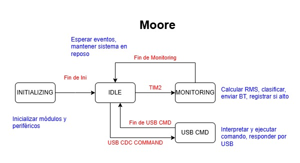

# PdM-_Proyecto_Sound_LVL
# Trabajo Práctico Final – Programación de Microcontroladores  
## Materia: Protocolos de Comunicación en Sistemas Embebidos

Este repositorio contiene el código fuente correspondiente al trabajo práctico final de la materia Protocolos de Comunicación en Sistemas Embebidos (PdM), dictada en el marco del posgrado en desarrollo de sistemas embebidos.

### Objetivo del trabajo

El objetivo principal fue desarrollar un sistema embebido funcional e integrado, aplicando múltiples periféricos del microcontrolador STM32, con énfasis en el uso correcto de interfaces de comunicación (UART, I2C, USB CDC), procesamiento eficiente con DMA, diseño modular y buenas prácticas de programación embebida.

### Descripción del sistema desarrollado

El sistema implementado permite detectar y clasificar el nivel de ruido ambiente utilizando un micrófono conectado al ADC. Las muestras se adquieren mediante DMA y se procesa su valor RMS (Root Mean Square) para estimar de manera confiable la amplitud del sonido.

Según los umbrales configurables, el sistema clasifica el sonido como bajo, medio o alto, y transmite esta información en tiempo real por UART hacia un módulo Bluetooth, que permite visualizarla desde una aplicación de terminal en un celular.

Además, cuando se detecta un evento de ruido alto, se registra junto con la fecha y hora en una memoria EEPROM I2C externa. La hora es proporcionada por un módulo RTC (DS1307), también conectado por I2C. El evento se guarda como parte de un buffer circular persistente.

El sistema incluye una interfaz USB en modo CDC para comunicarse con una PC, desde donde se pueden ejecutar comandos para consultar o modificar los umbrales, leer los eventos almacenados, obtener o actualizar la hora del sistema, y recibir ayuda sobre los comandos disponibles. También se dispone de una UART secundaria dedicada a depuración.

Un botón físico con manejo de antirrebote permite ejecutar acciones locales como restaurar los valores por defecto o borrar el log de eventos, sin necesidad de interfaz gráfica.

### Diagrama de bloques del sistema

---

### Diagrama de la máquina de estados (MEF)

